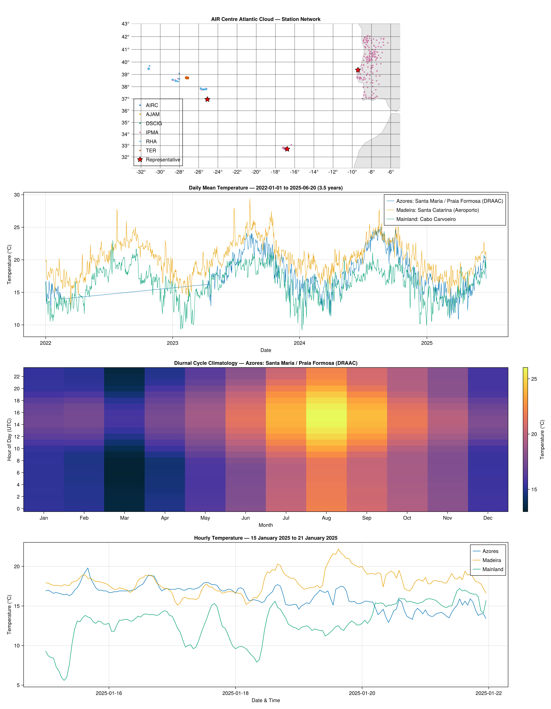

# AtlanticCloud.jl

[](https://github.com/AIRCentre/AtlanticCloud.jl/actions/workflows/CI.yml)
[](https://aircentre.github.io/AtlanticCloud.jl/)
[](https://opensource.org/licenses/MIT)

A Julia client for the [AIR Centre](https://www.aircentre.org) Atlantic Cloud API, providing access to meteorological station data and observations across the Atlantic region.



## Features

- **340+ stations** across mainland Portugal, the Azores, and Madeira.
- **5+ years of hourly observations** — temperature, wind, humidity, radiation, precipitation, and pressure.
- **Bulk fetch** — retrieve observations for multiple stations in a single call with configurable error handling.
- **DataFrame integration** — convert results directly to DataFrames for analysis and plotting.
- **JuliaGeo compatible** — stations implement [GeoInterface.jl](https://github.com/JuliaGeo/GeoInterface.jl) `PointTrait`, so they work natively with GeoMakie, GeometryOps, GeoJSON.jl, and the wider JuliaGeo ecosystem.

## Installation

Once registered with the Julia General Registry:

```julia
using Pkg
Pkg.add("AtlanticCloud")
```

For now, install directly from the repository:

```julia
using Pkg
Pkg.add(url="https://github.com/AIRCentre/AtlanticCloud.jl")
```

## Authentication

An API key is required. Register at [services.aircentre.org/access/account](https://services.aircentre.org/access/account).

Set your key as an environment variable:

```bash
export ATLANTICCLOUD_API_KEY="your_key_here"
```

Or pass it directly:

```julia
client = AtlanticCloudClient(api_key="your_key_here")
```

## Quick start

```julia
using AtlanticCloud
using Dates
using DataFrames

# Create a client (reads ATLANTICCLOUD_API_KEY from environment)
client = AtlanticCloudClient()

# List all stations
stations = get_stations(client)

# Filter by data source
ipma_stations = get_stations(client, source="IPMA")

# Get observations for a station
obs = get_observations(client, "11217160",
    start_date=Date(2024, 1, 1),
    end_date=Date(2024, 1, 31))

# Select specific metrics
obs_temp = get_observations(client, "11217160",
    start_date=Date(2024, 1, 1),
    end_date=Date(2024, 1, 31),
    metrics=["temperature_c", "wind_speed_kmh"])

# Convert to a DataFrame
df = to_dataframe(obs)

# Bulk fetch across multiple stations
ids = [s.station_id for s in stations if s.station_id !== nothing]
bulk_obs = get_observations_bulk(client, ids[1:5],
    start_date=Date(2024, 1, 1),
    end_date=Date(2024, 1, 7))
df_bulk = to_dataframe(bulk_obs)
```

## GeoInterface integration

Stations implement `PointTrait`, so they work directly with JuliaGeo packages:

```julia
import GeoInterface as GI

s = stations[1]
GI.geomtrait(s)              # PointTrait()
GI.x(GI.PointTrait(), s)     # longitude
GI.y(GI.PointTrait(), s)     # latitude
```

## Available metrics

| Metric | Unit | Notes |
|--------|------|-------|
| `temperature_c` | °C | Air temperature |
| `wind_speed_kmh` | km/h | Wind speed |
| `wind_direction_bin` | integer | Wind direction bin index |
| `rel_humidity_pctg` | % | Relative humidity |
| `radiation_kjm2` | kJ/m² | Solar radiation |
| `precipitation_accum_mm` | mm | Accumulated precipitation |
| `pressure_hpa` | hPa | Atmospheric pressure (limited station coverage) |

## API documentation

- **Package docs:** [aircentre.github.io/AtlanticCloud.jl](https://aircentre.github.io/AtlanticCloud.jl/)
- Meteorology API: [services.aircentre.org/access/docs/meteorology](https://services.aircentre.org/access/docs/meteorology)
- EO Catalog: [eo-catalog.ac-az1.aircentre.org/api/v1/api](https://eo-catalog.ac-az1.aircentre.org/api/v1/api) (coming soon)

## Contributing

This package is developed by [AIR Centre](https://www.aircentre.org).
Issues and pull requests are welcome. For questions, contact [dev@aircentre.org](mailto:dev@aircentre.org).