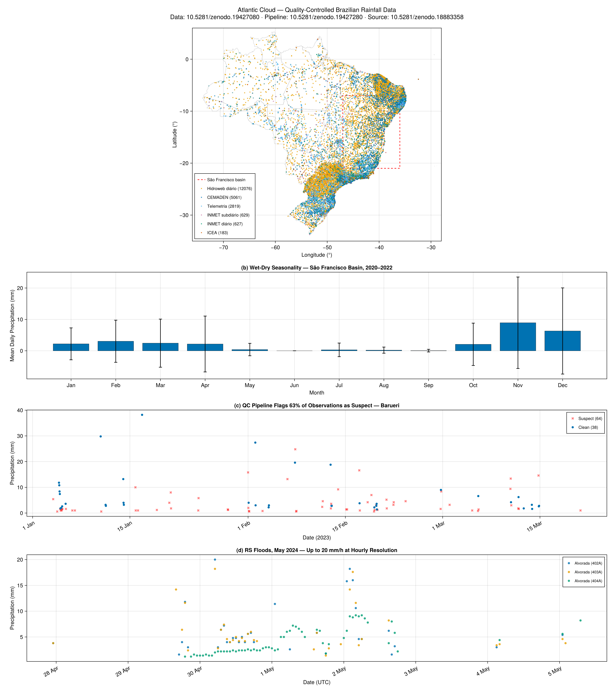
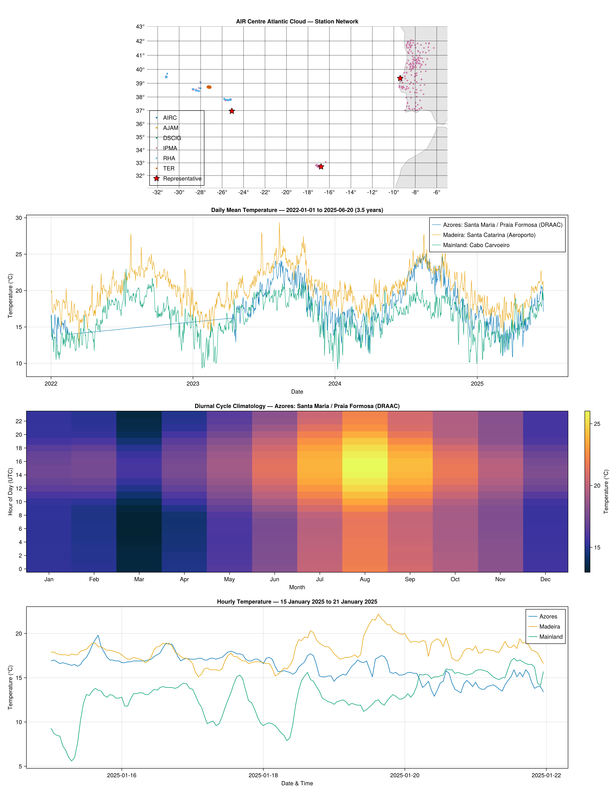

# Examples

## Brazilian rainfall showcase

The figure below demonstrates the package's Brazilian rainfall capabilities: station discovery across six national networks, daily and hourly observation retrieval, QC flag filtering, and time series visualisation — all fetched live from the API and plotted with [CairoMakie.jl](https://github.com/MakieOrg/Makie.jl) and [NaturalEarth.jl](https://github.com/JuliaGeo/NaturalEarth.jl).



**Panel (a) — Station coverage.** All 21,395 Brazilian rain gauges plotted by longitude and latitude over state boundaries, coloured by network (CEMADEN, Hidroweb diário, INMET, Telemetria, ICEA). The dashed rectangle marks the São Francisco basin bounding box used in panel (b).

**Panel (b) — Wet-dry seasonality.** Monthly mean daily precipitation across 8 stations in the São Francisco basin (2020–2022), computed from daily resolution data. The pronounced wet season (October–March) and dry season (April–September) are clearly visible.

**Panel (c) — QC filtering.** Three months of hourly rainfall at a CEMADEN gauge near São Paulo, showing clean observations and suspect observations flagged by the QC pipeline. Users can include or exclude flagged data at query time with the `flagged` parameter.

**Panel (d) — Extreme event.** Hourly rainfall at three stations during the May 2024 Rio Grande do Sul floods, demonstrating the temporal resolution available in the hourly dataset. Peak accumulations reached 20 mm/h.

### Running the demo

The script lives in `examples/brazil_rainfall.jl` with its own environment:

```bash
cd examples
julia --project=. -e 'using Pkg; Pkg.develop(path=".."); Pkg.instantiate()'
export ATLANTICCLOUD_API_KEY="your_key_here"
julia --project=. brazil_rainfall.jl
```

## Atlantic weather showcase (Portugal)

The figure below demonstrates the package's Portuguese weather capabilities: station discovery, bulk observation retrieval, and DataFrame conversion.



**Panel 1 — Station network.** All Portuguese stations plotted by longitude and latitude, coloured by data source (IPMA, RHA, DSCIG, AIRC, AJAM, TER). Red stars mark the representative stations used in the time series below.

**Panel 2 — Hourly temperature.** One month of hourly temperature data for three stations spanning the Atlantic region. The latitudinal temperature gradient is clearly visible: Madeira (warmest), Azores (mid-range), and mainland Portugal (coolest, with larger diurnal swings).

**Panel 3 — Data completeness.** Observation counts per station for the same period, showing near-complete hourly coverage (~700 observations per station for 31 days).

### Running the demo

```bash
cd examples
julia --project=. -e 'using Pkg; Pkg.develop(path=".."); Pkg.instantiate()'
export ATLANTICCLOUD_API_KEY="your_key_here"
julia --project=. atlantic_weather.jl
```

## Key code patterns

### Fetch stations and convert to DataFrame

```julia
using AtlanticCloud, DataFrames

client = AtlanticCloudClient()
stations = get_stations(client)
df = to_dataframe(stations)
```

### Bulk fetch Portuguese observations

```julia
using Dates

ids = [s.station_id for s in stations if s.station_id !== nothing]
obs = get_observations_bulk(client, ids,
    start_date=Date(2024, 12, 1),
    end_date=Date(2024, 12, 31),
    metrics=["temperature_c"],
    on_error=:warn)

df_obs = to_dataframe(obs)
```

### Query Brazilian rainfall by state

```julia
br_obs = get_br_observations(client,
    resolution="hourly", state="SP",
    start_date=Date(2020, 1, 1),
    end_date=Date(2020, 1, 31))

df_br = to_dataframe(br_obs)
```

### Bulk fetch Brazilian rainfall across stations

```julia
sp = get_stations(client, country="BR", state="SP")
ids = [s.station_id for s in sp if s.station_id !== nothing]
bulk = get_br_observations_bulk(client, ids[1:10],
    resolution="hourly",
    start_date=Date(2020, 1, 1),
    end_date=Date(2020, 1, 7),
    on_error=:warn)
df_bulk = to_dataframe(bulk)
```

### Use GeoInterface for spatial workflows

```julia
import GeoInterface as GI

s = stations[1]
GI.geomtrait(s)        # PointTrait()
GI.x(GI.PointTrait(), s)  # longitude
GI.y(GI.PointTrait(), s)  # latitude
```

Stations implement `PointTrait`, so they work directly with GeoMakie, NaturalEarth.jl, GeometryOps, GeoJSON.jl, and any other JuliaGeo-compatible package.
